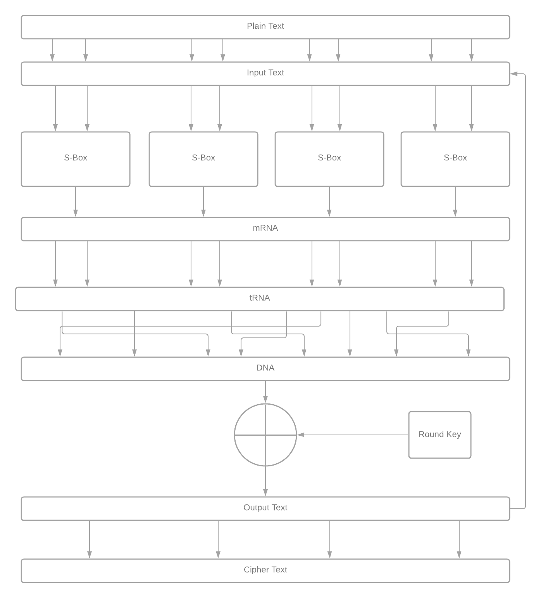

# DNA Kriptografija

## Usage

Encryption:

	python encrypt.py <key[int]> <plain-text[string]>

Decryption:

	python decrypt.py <key[int]> <cipher-text[string]>

## Biologija

### DNA (Deoksiribonukleinska kislina) 

je mulekula, ki je nosilka genetske informacije v vseh živih organizmih. Ima obliko dvojne vijačnice, pri čemer se dve mulekuli ovijeta druga okrog druge, pri čemer se dušikove baze vežejo v parih. Adenin se vedno pari s timinom in citozin vedno z gvaninom.

### Osnovni elementi

**Nukleotid** je osnovna enota DNA, ki je sestavljena iz sladkorja, dušikove baze in fosfatne skupine.
**Kodon** so trije pari nukleotidov (pari v dvojni vijačnici).
Osnovni elementi, ki jih bomo uporabljali (analogno iz digitalnih vezjih) kot en-bit informacije so dušikove baze: Adenin(A), Gvanin(G), Citozin(C) in Timin(T).

## mRNA

je mulekula, ki širi oz. prepisuje genetsko informacijo iz DNA. 
Konceptno deluje tako, da v procesu prepisovanja(iz ene izmed verig dvojne vijačnice) mRNA tvori enoverižno molekulo, pri čemer Timin nadomesi Uracilom, preostanek prebrane verige ostane enak.
Torej če imamo sledečo dvojno vijačnico in mRNA, ki prebira:

    A G G G A (zgornja veriga)
    | | | | | (vez med paroma)  DNA
    T C C C T (spodnja veriga)
    ----------
    U C C C U (mRNA, ki prebere spodnjo verigo) 

## tRNA

tRNA je mulekula, ki prevaja mRNA v eno izmed aminokislin. 
Vsaka tRNA molekula ima tri nukleotide skupaj imenovane antikodon, in cilj prevajanje je da tRNA se poveže v mRNA s takšno kombinacijo nukleotidov, ki bo ravno komplement nukleotidov tRNA-ja in če takšna kombinacija nukleotidov obstaja bo ta ista tRNA omogočila prevod kodona mRNA v aminokislino. 
Torej prevod celotne mRNA verige je enako komplementu dušikovih baz, ki nato skupaj tvorijo enoverižno mulekulo.
Komplementi dušikovih baz so sledeči:

	Gvanin --> Citozin
	Citozin --> Gvanin
	Adenin --> Uracil
	Uracil --> Adenin

tRNA je nazaj pretvorimo v DNA mulekulo tako da Uracil nadomestimo z Timinom.

Tabela prevoda tRNA v aminokislino:

Operacija transkripcije (s pomočjo mRNA) in translacije (s pomočjo tRNA) vizualizirana:

## Zapisovanje binarnih podatkov v DNA

Dandanes je zelo pomembno področje raziskovanja efektivno in zgoščeno shranjevanje podatkov. 
Pri tem ima DNA nit zelo velik potencial zaradi visoke zgoščenosti ter dolgoročnosti shrambe, vendar je pred končno uresničitvijo ideje potrebno odpraviti še kar nekaj težav kot so naprimer, počasni zapis in branje podatkov iz niti, visoke cena...
Kot pri vsakem izmed zapisov ali branju podatka obstaja možnost da pride do napake( zaradi spontane napake, UV žarki, toplota itd.), kar velja tudi za DNA niti.
Ene izmed možnih napak so:
- Zamenjava baze (analogno se dogodi v električnih vezjih ti. bit-flip)
- Mutacija kodonov (Izbrisan ali dodan nukleotid, spremeni celotno sekvenco nukleotidov, kateri so po tri spadali h kodonom)

Raziskave so pokazale, da je pogostost napak, ki se lahko pripetijo določenemu tipu nukleotida je večja ali manjša od preostalih. Upoštevajoč to lastnost lahko v primeru teksta, pogostejše črke kot so (e,a,t ..) zapisujemo v kombinaciji dušikovih baz, ki bolj zanesljive oz. je manjša verjetnost da pride do napak in s tem izboljšamo zanesljivost zapisa, branja in hrambe podatkov.
To lastnost izkorišča Hufmanovo enkodiranje, ki ASCII vrednostim pogostejšim črkam pripisuje zanesljivejše kombinacije dušikovih baz.
Tabela prestavlja preslikava:

Kljub temu da je Huffmanovo enkodiranje tako učinkovito je precej nepraktično ko je potrebno tekst dekriptirati, saj je izredno težko določiti kateri črki sekvenca dušikovih baz pripada, saj posamezni črki pripada lahko med 1-5 dušikovih baz. 
Enostavna rešitev bi bila da dodamo indekse, koliko dušikovih baz moramo upoštevati pri dekripiciji posamezne črke ampak je to precej nepraktično saj s tem podatkom napadalci lahko enostavno dešifrirajo tekst(ker je samo 128 simbolov v ASCII standardu).
Zato enkodiranje prilagodimo in uporabimo za vsako črko 4 dušikove baze [2]:

| a | ACAT | y | AAAA | & | GGTG |
|---|------|---|------|---|------|
| b | ACTG | v | CCCC | Q | TATC |
| c | ACCC | w | GCTA | R | TACG |
| d | ACGA | x | GCCC | S | CATC |
| e | TCAT | z | AATT | T | CACC |
| f | TCTG | A | AACC | U | GATT |
| g | TCCG | B | AAGG | V | GACC |
| h | TCGT | C | TAAT | W | ATAA |
| i | CCAG | D | TATG | X | ATTT |
| j | CCTA | E | TACC | Y | ATCG |
| k | CCCG | F | TAGA | Z | ATGC |
| l | CCGG | G | CAAT | 0 | TTAA |
| m | GCAA | H | CATG | 1 | TTTT |
| n | GCTT | I | CACG | 2 | TTCC |
| o | GCCG | J | CAGT | 3 | TTGG |
| p | GCGC | K | GAAG | 4 | CTAT |
| q | ACTC | L | GATA | 5 | CTTG |
| r | ACCG | M | GACG | 6 | CTCC |
| s | TCTC | N | GAGG | 7 | CTGA |
| t | TCCC | O | AATA | 8 | GTAT |
| u | CCTT | P | AACG | 9 | GTTG |

   
Pomembno je dodati da se vsak zapis oz. začetek DNA začne z start kodonom, ki je običajno kombinacija ATG dušikovih baz, pri čemer konec zapisa DNA naznanimo z stop kodonom, ki bo v našem primeru TAG kombinacija dušikovih baz. 

## Padding 

Zaradi same narave besedil in procesa Huffmanovega enkodiranja, ki eni črki lahko pridedi kombinacijo več dušikovih baz, je potrebno pred enkriptiranjem poskrbeti da je dolžina DNA sekvence posameznega bloka enaka 32. 
To pa zato, ker vsaki bazi pripadata dva bita(torej dolžnina sekvence bitov bo enaka 64) in ker bomo uporabljali 8-bitne substitucijske škatle (S-box). 
Če pogoju besedilo ne zadosti na koncu besedila dopolnimo verigo z Gvaninom(G), saj so raziskave pokazale da je le ta najbolj odporen na spontane genske napake [1].

## SP Mreža (ang. SPN)

Substitucijska-Permutacijska mreža krajše SP Mreža je osnovna komponenta nekaterih glavnih enkripcijskih algoritmov kot so AES, DES itd. Glavne lastnosti so predvsem enostavnost, hitrost ter učinkovist. 
Kot že ime pove bo sestavljena iz S-škatel (substitucija) in P-škatel(permutacija) ter XOR operacije z ključem-kroga.

## S-box

### Rijndael S-škatla

Za substitucijsko škatlo obstaja standard, ki zagotavlja zadostno difuzijo ter konfuzijo teksta. Temu primerno vzamemo kar enako tabelo kot za AES, le da je priredimo za substitucijo z dušikovimi bazami:

|   | AA | AG | AC | AT | GA | GG | GC | GT | CA | CG | CC | CT | TA | TC | TG | TT |
|-----|-----|-----|-----|-----|-----|-----|-----|-----|-----|-----|-----|-----|-----|-----|-----|-----|
| AA | GCAT | GTTA | GTGT | GTCT | TTAC | GCCT | GCTT | TAGG | ATAA | AAAG | GCGT | ACCT | TTTG | TCGT | CCCT | GTGC |
| AG | TACC | CAAC | TACG | GTTC | TTCC | GGCG | GAGT | TTAA | CCTC | TCGA | CCAC | CCTT | CGTA | CCGA | GTAC | TAAA |
| AC | CTGT | TTTC | CGAT | ACGC | ATGC | ATTT | TTGT | TATA | ATGA | CCGG | TGGG | TTAG | GTAG | TCCA | ATAG | AGGG |
| AT | AAGA | TAGT | ACAT | TAAT | AGCA | CGGC | AAGG | CGCC | AAGT | AGAC | CAAA | TGAC | TGCT | ACGT | CTAC | GTGG |
| GA | AACG | CAAT | ACTA | AGCC | AGCT | GCTG | GGCC | CCAA | GGAC | ATCT | TCGC | CTAT | ACCG | TGAT | ACTT | CAGA |
| GG | GGAT | TCAG | AAAA | TGTC | ACAA | TTTA | CTAG | GGCT | GCCC | TACT | CTTG | ATCG | GACC | GATA | GGCA | TATT |
| GC | TCAA | TGTT | CCCC | TTCT | GAAT | GATC | ATAT | CAGG | GAGG | TTCG | AAAC | GTTT | GGAA | ATTA | CGTT | CCCA |
| GT | GGAG | CCAT | GAAA | CATT | CGAC | CGTC | ATCA | TTGG | CTTA | CTGC | TCCC | ACAG | AGAA | TTTT | TTAT | TCAC |
| CA | TATC | AATA | AGAT | TGTA | GGTT | CGGT | GAGA | AGGT | TAGA | CCGT | GTTG | ATTC | GCGA | GGTC | AGCG | GTAT |
| CG | GCAA | CAAG | GATT | TCTA | ACAC | ACCC | CGAA | CACA | GAGC | TGTG | CTCA | AGGA | TCTG | GGTG | AACT | TCCT |
| CC | TGAA | ATAC | ATCC | AACC | GACG | AAGC | ACGA | GGTA | TAAC | TCAT | CCTA | GCAC | CGAG | CGGG | TGGA | GTCG |
| CT | TGGT | TACA | ATGT | GCTC | CATC | TCGG | GATG | CCCG | GCTA | GGGC | TTGA | TGCC | GCGG | GTCC | CCTG | AACA |
| TA | CTCC | GTCA | ACGG | ACTG | AGTA | CCGC | CTGA | TAGC | TGCA | TCTC | GTGA | AGTT | GACT | CTTC | CACT | CACC |
| TC | GTAA | ATTG | CTGG | GCGC | GACA | AAAT | TTGC | AATG | GCAG | ATGG | GGGT | CTCG | CAGC | TAAG | AGTC | CGTG |
| TG | TGAG | TTCA | CGCA | AGAG | GCCG | TCCG | CATG | CGGA | CGCT | AGTG | CAGT | TGCG | TATG | GGGG | ACCA | TCTT |
| TT | CATA | CCAG | CACG | AATC | CTTT | TGGC | GAAC | GCCA | GAAG | CGCG | ACTC | AATT | CTAA | GGGA | CTCT | AGGC |

### Inverzna Rijndael S-Škatla

|   | AA | AG | AC | AT | GA | GG | GC | GT | CA | CG | CC | CT | TA | TC | TG | TT |
|-----|-----|-----|-----|-----|-----|-----|-----|-----|-----|-----|-----|-----|-----|-----|-----|-----|
| AA | GGAC | AACG | GCCC | TCGG | ATAA | ATGC | CCGG | ATCA | CTTT | GAAA | CCAT | CGTG | CAAG | TTAT | TCGT | TTCT |
| AG | GTTA | TGAT | ATCG | CAAC | CGCT | ACTT | TTTT | CAGT | ATGA | CATG | GAAT | GAGA | TAGA | TCTG | TGCG | TACT |
| AC | GGGA | GTCT | CGGA | ATAC | CCGC | TAAC | ACAT | ATTC | TGTG | GATA | CGGG | AACT | GAAC | TTCC | TAAT | GATG |
| AT | AACA | ACTG | CCAG | GCGC | ACCA | TCCG | ACGA | CTAC | GTGC | GGCT | CCAC | GACG | GCTC | CACT | TCAG | ACGG |
| GA | GTAC | TTCA | TTGC | GCGA | CAGC | GCCA | CGCA | AGGC | TCGA | CCGA | GGTA | TATA | GGTC | GCGG | CTGC | CGAC |
| GG | GCTA | GTAA | GACA | GGAA | TTTC | TGTC | CTCG | TCCC | GGTG | AGGG | GAGC | GGGT | CCGT | CATC | CGTC | CAGA |
| GC | CGAA | TCCA | CCCT | AAAA | CATA | CTTA | TCAT | AACC | TTGT | TGGA | GGCA | AAGG | CTCA | CTAT | GAGG | AAGC |
| GT | TCAA | ACTA | AGTG | CATT | TACC | ATTT | AATT | AAAC | TAAG | CCTT | CTTC | AAAT | AAAG | AGAT | CACC | GCCT |
| CA | ATCC | CGAG | AGAG | GAAG | GATT | GCGT | TCTA | TGCC | CGGT | TTAC | TATT | TATG | TTAA | CTGA | TGGC | GTAT |
| CG | CGGC | CCTA | GTGA | ACAC | TGGT | CCTC | ATGG | CAGG | TGAC | TTCG | ATGT | TGCA | AGTA | GTGG | TCTT | GCTG |
| CC | GAGT | TTAG | AGCC | GTAG | AGTC | ACCG | TAGG | CACG | GCTT | CTGT | GCAC | AATG | CCCC | AGCA | CTTG | AGCT |
| CT | TTTA | GGGC | ATTG | GACT | TAGC | TCAC | GTCG | ACAA | CGCC | TCCT | TAAA | TTTG | GTCA | TATC | GGCC | TTGA |
| TA | AGTT | TCTC | CCCA | ATAT | CACA | AAGT | TAGT | ATAG | CTAG | AGAC | AGAA | GGCG | ACGT | CAAA | TGTA | GGTT |
| TC | GCAA | GGAG | GTTT | CCCG | AGCG | CTGG | GACC | AATC | ACTC | TGGG | GTCC | CGTT | CGAT | TACG | CGTA | TGTT |
| TG | CCAA | TGAA | ATCT | GATC | CCTG | ACCC | TTGG | CTAA | TACA | TGCT | CTCT | ATTA | CAAT | GGAT | CGCG | GCAG |
| TT | AGGT | ACCT | AAGA | GTTG | CTCC | GTGT | TCGC | ACGC | TGAG | GCCG | AGGA | GCAT | GGGG | ACAG | AATA | GTTC |
## P-škatle

V našem primeru bodo permutacijske škatle permutirale vhodne bite s pomočjo mRNA in tRNA operacij(opisane zgoraj) ter pretvorbe nazaj v DNA sekvenco. 
Če povzamemo iz opisa operacij, za posamezno bazo to pomeni:

	T --> U --> A --> A
	A --> A --> U --> T
	C --> C --> G --> G
	G --> G --> C --> C

S pomočjo testa difuzije smo ugotovili da operaciji mRNA in tRNA ne zagotoviti zadovoljive enkripcije, zatorej smo le to izboljšali s pomočjo standarnega 64-bitnega P-boxa:

| 58 | 50 | 42 | 34 | 26 | 18 | 10 | 2 |
|:--:|:-:|:--:|:--:|:--:|:--:|:--:|:--:|
| 60 | 52 | 44 | 36 | 28 | 20 | 12 | 4 |
| 62 | 54 | 46 | 38 | 30 | 22 | 14 | 6 |
| 64 | 56 | 48 | 40 | 32 | 24 | 16 | 8 |
| 57 | 49 | 41 | 33 | 25 | 17 | 9  | 1 |
| 59 | 51 | 43 | 35 | 27 | 19 | 11 | 3 |
| 61 | 53 | 45 | 37 | 29 | 21 | 13 | 5 |
| 63 | 55 | 47 | 39 | 31 | 23 | 15 | 7 |

Pri čemer na prvo mesto pride baza na 58 indeksu, na drugo mesto baza na 50 indeksu in tako naprej.

In inverz P-škatle:

| 40 | 8 | 48 | 16 | 56 | 24 | 64 | 32 |
|:--:|:-:|:--:|:--:|:--:|:--:|:--:|:--:|
| 39 | 7 | 47 | 15 | 55 | 23 | 63 | 31 |
| 38 | 6 | 46 | 14 | 54 | 22 | 62 | 30 |
| 37 | 5 | 45 | 13 | 53 | 21 | 61 | 29 |
| 36 | 4 | 44 | 12 | 52 | 20 | 60 | 28 |
| 35 | 3 | 43 | 11 | 51 | 19 | 59 | 27 |
| 34 | 2 | 42 | 10 | 50 | 18 | 58 | 26 |
| 33 | 1 | 41 | 9  | 49 | 17 | 57 | 25 |

## XOR z ključem-kroga

Preden naredimo XOR z ključem-kroga pretvorimo posamezno bazo v bite na sledeči način:

    Adenin(A) <=> 00
    Gvanin(G) <=> 01
    Citozin(C) <=> 10
    Timin(T) <=> 11

Nato 64-bitni tekst in 64-bitni ključ-kroga XOR-amo ter rezultat pretvorimo nazaj v dušikove baze.

## Generacija ključev-kroga

Iz primarnega ključa (ki je v našem algoritmu nujno integer zaradi načina generiranja), ki ga uporabnik izbere se zgenerira toliko ključev-kroga kolikor je krogov enkripcije SP mreže.

## Integriteta shranjenih podatkov

Da zagotovimo, da shranjeni podatki niso spremenjeni, torej da zakriptiran tekst v bazi ni zlonamerno spremenjen dodamo podatkom še hash, ki je izračunan s pomočjo enkripcijkega ključa in podatkov, tako da ko podatke prebiramo iz podatkovne baze lahko preverimo, da le ti niso bili spremenjeni brez našega vedenja.

To odpre novo razmišljanje, namreč zagotoviti moramo da če pride do spontanih genskih mutacij, da smo jih sposobni zaznati in odpraviti, drugače bo izračunan hash napačen, ko bomo brali podatke iz zapisa.

## Spontane genske mutacije

Ker vedno obstaja verjetnost mutacije genskega zapisa, dodamo funkcionalnost simuliranja genskih mutaciji.
Konkretno izpostavimo dva tipa mutacij.

- Zamenjava baze (analogno se dogodi v električnih vezjih ti. bit-flip)
- Mutacija kodonov (Izbrisan ali dodan nukleotid, spremeni celotno sekvenco nukleotidov, kateri so po tri spadali h kodonom)

## Zaznava in popravek genskih mutacij

Iz kriptiranega genskega zapisamo izračunamo hash za vsakih m nukleotidov.
Preden se lotimo dekripcije genskega zapisa, simuliramo napako oz. mutacijo pri kateri se baza zamenja.
Mutacijo detektiramo z ponovnim izračunom hash-a za vsakih m nukleotidov. V primeru ko se izracuni hash ne ujema z originalnim
hashom vemo, da je na tem mestu prišlo do napake. Napako odpravimo z racunanjem vseh kombinacij niza "ATGC" dolzine m in racunanjem hasha
dokler se ta ne ujema z originalnim hashom. Napako v genskem zapisu odpravimo.

Vrednost parametra m nastavimo na 3, zavedamo se da je stevilo zahtevanih shiftov enako 4^m, za vsak odsek kjer do napake pride. 
Torej v primeru ko je mutiran vsak kodon, moramo izracunati (4 ^ 3) * (len / 3) kombinacij. Zanasamo se na dejstvo da so mutacije genskega
zapisa redke. 

Alternative pristop bi bilo reproduciranje genskega zapisa in izbor najbolj pogostega niza na območju napake.

	m = 3
	num_of_mutations = 6

	Original  = 'TAGTCCGATTAGTCAAGTCAGTCCTTCTGTGCCTGTGCCCAATTTATCGATGG'
	Mutated   = 'AAGTCCGATTAGTTAAGTGAGTCCTTTTGTGCCTGAGCCCAATTTATGGATGG'
	Corrected = 'TAGTCCGATTAGTCAAGTCAGTCCTTCTGTGCCTGTGCCCAATTTATCGATGG'

## Test difuzije 

Sprememba ene izmed črke vhodnega teksta, vpliva na vse vrednosti izhoda.

	pirsing -> ACCCACCCTACGACGAAAAAATATAGGTCGAC
	pissing -> ACGGTCAAATCTGTATGCCGCACATCACGAGT
	kissing -> CAGACAGATGAGACACACTAAAATGTCGGCAT

## Test konfuzije

Nobene zveze med ključem in besedilom, torej če v ključu spremenimo en znak, bi to moralo vplivati na celotno zašifrirano besedilo.

Obakrat zašifriramo besedo cokolada:

	Ključ "1111" -> GGAATCTTGGCTTTCCGTAATCTGAGTCCTCC
	Ključ "1211" -> CGCATAGGACTTTTTAGAGCGAACACCGGTTG

## References

[1] https://web.stanford.edu/~kaleeg/chem32/biopol/  
[2] https://www.sciencedirect.com/science/article/pii/S187705091500109X
